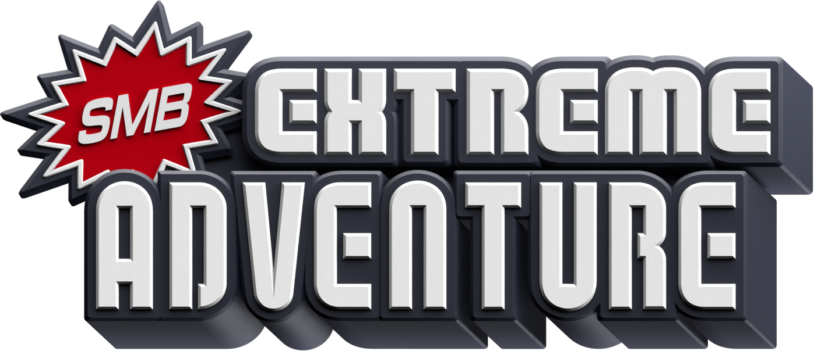

# Super Mario Bros. Extreme Adventure
Super Mario Bros. Extreme Adventure is a NSMBW fan-made in developement by The Team Alternative since December 2022 and it uses the same Game Engine of <a href="https://newerteam.com/wii/">Newer Super Mario Bros Wii.</a>In the game there are 4 New Worlds (3 + 1 Bonus Worlds) with a Real Life based theme for each world. There are 15 Levels for each world (12 + 3 Bonus Levels) and a New Power-Up: The Note Suit. At the moment there is NO release date for the Full Version, but we are sure that it will bereleased until the half of 2024.

## Our Socials
<a href="https://discord.gg/Ujjxj3GwTM">Discord</a>
<a href="https://www.youtube.com/@TeamAlternative2023/videos">Youtube</a>
<a href="https://teamalternative2023.github.io/TheTeamAlternative.github.io/">Website</a>

## The Staff
- *Mone*: **Project Director**, **World 3 Maker**, **Code Compiler**, **Web Developer** and **Custom Music Importer**
- *Isaac*: **Music Composer**
- *Lavrenzy*: **World 1** and **World 2** Maker, **Russian Game Translation** (*Only on Full Version*), **Cutscene Director** and **SFX Recorder**
- *Synel*: **Game Features** and **Sprite Programmer**
- *Wakanameko*: **Japanese Game Translation** (*Only on Full Version*) and **Boss Programmer** (*Only on Full Version*)
- *Jacopo Plays*: **Beta Tester** and **Layout Designer**
- *Bafio*: **Cutscene Maker**
- *aqua21*: **Web Developer**

